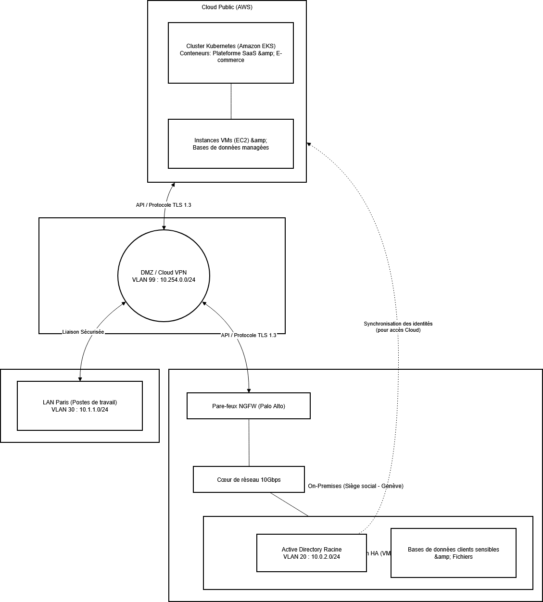
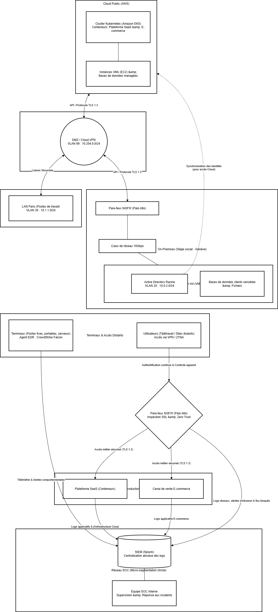

# Projet CYNA — Modernisation & Migration Infrastructure IT

**Projet Fil Rouge CPI SRC | Ingetis 2025**

---

## 📋 Contexte

CYNA est une entreprise de cybersécurité (~200 collaborateurs) opérant un SOC 24/7 et proposant des services managés (EDR, XDR, SaaS). Dans le cadre de sa croissance, CYNA migre son siège social à **Genève** et ouvre une **filiale à Paris**.

Ce projet documente la conception et la mise en œuvre de leur nouvelle infrastructure IT : refonte complète vers un modèle **cloud hybride**, adoption d'une architecture **Zero Trust**, et industrialisation des déploiements via une approche **DevOps / Infrastructure as Code**.

---

## 🎯 Objectifs

- Assurer la **continuité opérationnelle du SOC** pendant et après la migration
- Intégrer la **filiale Paris** au système d'information de Genève (AD, VPN, accès SaaS)
- Mettre en place une infrastructure **cloud hybride AWS** (EKS, EC2, RDS)
- Automatiser les déploiements avec **Terraform + Ansible** (IaC)
- Appliquer les principes **Zero Trust** : micro-segmentation, MFA, ZTNA, inspection SSL

---

## 🏗️ Architecture cible

### Schéma réseau global (Genève / Paris / Cloud AWS)

*Vue d'ensemble de l'interconnexion entre le siège de Genève (On-Premises), la filiale Paris (LAN distant) et le Cloud Public AWS, via la DMZ/VPN VLAN 99.*

---

### Diagramme des flux (SOC, SIEM, SaaS, E-commerce)

*Flux de données entre les terminaux, le pare-feu NGFW Palo Alto, les plateformes SaaS/E-commerce, et la centralisation des logs dans Splunk (SIEM) pour supervision par l'équipe SOC.*

---

### Plan d'adressage IP

| Réseau               | Plage IP        | VLAN | Usage                        |
|----------------------|-----------------|------|------------------------------|
| On-Premises Genève   | 10.0.2.0/24     | 20   | AD / Serveurs                |
| LAN Paris            | 10.1.1.0/24     | 30   | Postes filiale               |
| DMZ / VPN Cloud      | 10.254.0.0/24   | 99   | Zone démilitarisée           |

---

## 👥 Équipe

| Membre   | Rôle                                  |
|----------|---------------------------------------|
| Corentin | Sécurité — Lead                       |
| Ugo      | Infrastructure réseau                 |
| Praveen  | Administration équipements utilisateurs |
| Hugo     | DevOps & Automatisation               |
