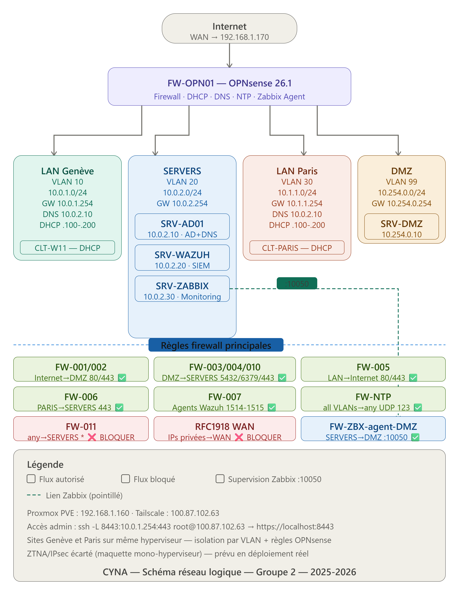

# Projet CYNA — Infrastructure Cybersécurité Hybride

> **Projet Fil Rouge** — CPI SRC 2025-2026 — Ingetis / CFA ITIS — Groupe 1
> Dossier d'Architecture Technique (DAT) et fichiers de configuration de l'infrastructure CYNA.

CYNA est une entreprise fictive de cybersécurité (~200 collaborateurs, SOC) répartie sur deux sites (Genève et Paris). Ce dépôt regroupe la documentation d'architecture et l'ensemble des fichiers de configuration permettant de comprendre et reproduire l'infrastructure déployée.

---

## Équipe

| Membre | Rôle |
|--------|------|
| Hugo DELOGE | DevOps & Automatisation / Cloud (IaC, Terraform, Ansible, Azure) |
| Ugo PINCIROLI | Ingénieur Réseau (OPNsense, VLAN, DHCP/DNS) |
| Corentin GUIHAIRE | Architecte Sécurité (Wazuh, Suricata, MFA) |
| Praveen SOUBRAMANIEN | Administrateur Système (Active Directory, GPO) |
| Lucas MANICORD | Responsable Infrastructure (PRA/PCA, sauvegardes) |

---

## Architecture



L'infrastructure repose sur un hyperviseur **Proxmox VE** segmenté en VLAN, avec un pare-feu **OPNsense** assurant le routage inter-VLAN, le filtrage, le DHCP (Kea) et le DNS (Unbound).

### Plan d'adressage

| VLAN | Réseau | Usage |
|------|--------|-------|
| WAN | 192.168.1.0/24 | Accès Internet (DHCP) |
| 10 | 10.0.1.0/24 | LAN Genève — postes de travail |
| 20 | 10.0.2.0/24 | Serveurs internes (AD, Wazuh, Zabbix) |
| 30 | 10.1.1.0/24 | LAN Paris — postes de travail |
| 99 | 10.254.0.0/24 | DMZ — services exposés |

### Inventaire des hôtes

| Hôte | OS | Rôle | VLAN | IP |
|------|----|----|------|-----|
| fw-opn01 | OPNsense 26.1 | Pare-feu / routeur / DHCP / DNS | — | .254 |
| SRV-AD01 | Windows Server 2022 | Contrôleur de domaine AD + DNS | 20 | 10.0.2.10 |
| SRV-WAZUH | Ubuntu 26.04 | SIEM Wazuh + OpenSearch | 20 | 10.0.2.20 |
| SRV-ZABBIX | Ubuntu 26.04 | Supervision Zabbix 7.4 | 20 | 10.0.2.30 |
| SRV-DMZ | Ubuntu 26.04 | nginx — site vitrine | 99 | 10.254.0.10 |
| CLT-W11-GENEVE | Windows 11 | Poste de travail | 10 | 10.0.1.100 |
| CLT-W11-PARIS | Windows 11 | Poste de travail | 30 | 10.1.1.100 |

---

## Stack technique

- **Virtualisation :** Proxmox VE
- **Pare-feu / IDS-IPS :** OPNsense 26.1 + Suricata
- **IaC :** OpenTofu (provider bpg/proxmox) + Ansible (avec Vault)
- **Annuaire :** Active Directory (`cyna.local`), DHCP Kea, DNS Unbound
- **SIEM :** Wazuh 4.14 + OpenSearch
- **Supervision :** Zabbix 7.4 (PostgreSQL)
- **Web :** nginx (site vitrine DMZ)
- **Cloud :** Microsoft Azure — Entra ID (identité) + VNet/NSG (réseau)
- **MFA :** TOTP sur OPNsense

---

## Structure du dépôt

```
DAT_Groupe1_CPR/
├── DAT_CYBER_CYNA.docx          # Dossier d'Architecture Technique
├── README.md                    # Ce fichier
├── .gitignore                   # Exclusion des fichiers sensibles
└── config/
    ├── schemas/                 # Schémas réseau (draw.io / PNG)
    ├── opnsense/                # Config OPNsense (SANITISÉE — sans secrets)
    ├── terraform/               # Fichiers .tf (IaC Proxmox)
    ├── ansible/                 # Playbooks, inventaire, group_vars (Vault)
    ├── wazuh/                   # Règles custom (local_rules.xml), ossec.conf
    ├── zabbix/                  # zabbix_agent2.conf
    ├── nginx/                   # Config + site vitrine
    ├── scripts/                 # Scripts PowerShell (déploiement agents)
    └── netplan/                 # Configuration réseau des serveurs Linux
```

---

## Reproductibilité

### 1. Provisionnement des VM (OpenTofu)

```bash
cd config/terraform
tofu init
tofu plan
tofu apply
```

### 2. Configuration des serveurs (Ansible)

```bash
cd config/ansible
ansible-playbook playbooks/nginx-dmz.yml --ask-vault-pass
ansible-playbook playbooks/wazuh-agent-linux.yml --ask-vault-pass
ansible-playbook playbooks/zabbix-agent-linux.yml --ask-vault-pass
```

---

## Note de sécurité

Ce dépôt est **public**. Les fichiers de configuration ont été **assainis** : aucun secret n'y figure (mots de passe, clés API, seeds TOTP, clés privées, état Terraform). Les secrets utilisés par Ansible sont chiffrés via **Ansible Vault**. La configuration OPNsense est fournie dans une version expurgée de ses éléments sensibles. Les accès à l'infrastructure réelle sont restreints (réseau privé via Tailscale).
